# 蓝牙技术全景指南：从入门到实战

> 📡 面向软件开发人员的蓝牙技术完整教程，掌握核心概念、协议栈、开发实战与安全机制

---

## 目录

1. [蓝牙技术概述](#一蓝牙技术概述)
2. [协议栈架构详解](#二协议栈架构详解)
3. [连接管理与参数优化](#三连接管理与参数优化)
4. [GATT 数据传输](#四 gatt 数据传输)
5. [BLE 开发核心](#五 ble 开发核心)
6. [安全机制与配对](#六安全机制与配对)
7. [实践案例解析](#七实践案例解析)
8. [技术选型指南](#八技术选型指南)

---

## 一、蓝牙技术概述

### 1.1 什么是蓝牙？

蓝牙是一种工作在 **2.4GHz ISM 频段** 的短距离无线通信协议，采用 **跳频扩频 (FHSS)** 技术实现抗干扰。现代蓝牙支持两种模式：

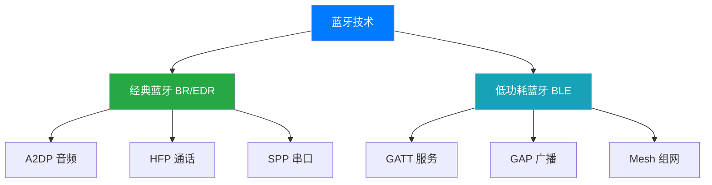

### 1.2 版本演进历程

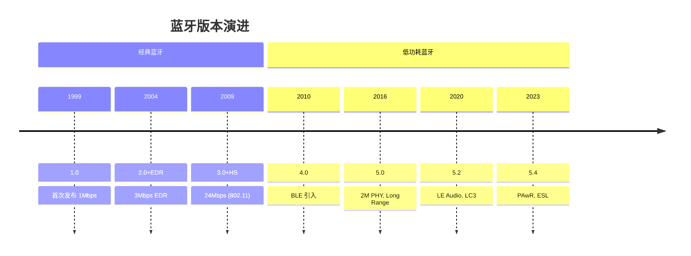

### 1.3 关键版本特性

| 版本 | 年份 | 关键特性 | 开发影响 |
|------|------|----------|----------|
| **4.0** | 2010 | BLE 首次引入 | IoT 设备起点，最低支持版本 |
| **4.2** | 2014 | IPv6, 隐私特性 | 支持直接联网，隐私地址 |
| **5.0** | 2016 | 2M PHY, LE Coded, 广播扩展 | 高速/长距离模式，定位应用 |
| **5.1** | 2019 | AOA/AOD 定位 | 室内定位，方向查找 |
| **5.2** | 2020 | LE Audio, LC3, Isochronous | 音频流，多设备同步 |
| **5.3** | 2021 | 连接子事件，信道分类 | 低功耗优化，抗干扰 |
| **5.4** | 2023 | PAwR, ESL, 加密广播 | 电子货架标签，双向通信 |

### 1.4 经典蓝牙 vs BLE 选型

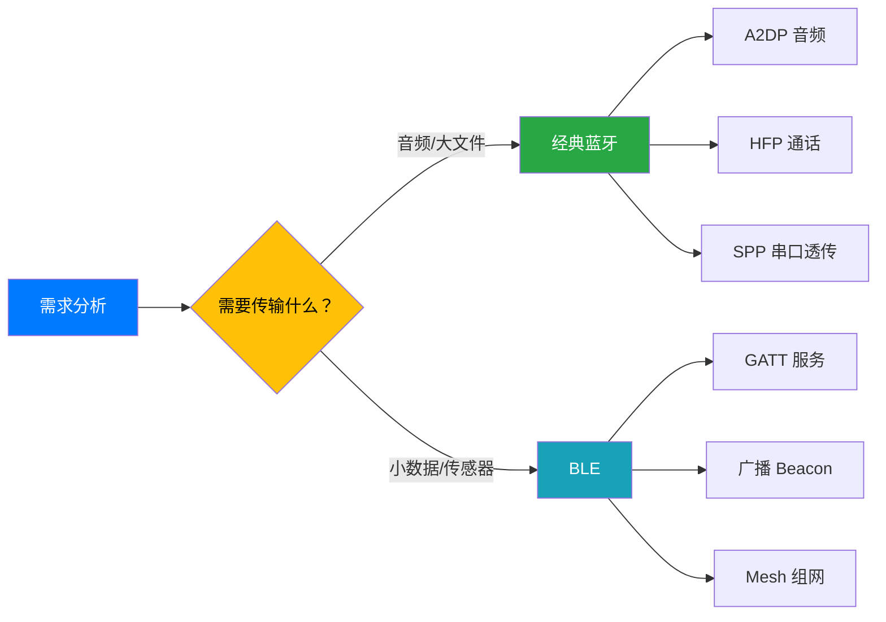

| 特性 | 经典蓝牙 (BR/EDR) | 低功耗蓝牙 (BLE) |
|------|-------------------|------------------|
| **典型速率** | 1-3 Mbps | 125kbps - 2 Mbps |
| **功耗** | 30mA (峰值) | 15mA (峰值), μA (待机) |
| **连接时间** | 数秒 | 3-6ms |
| **拓扑** | 点对点/点对多点 | 广播/星型/Mesh |
| **典型应用** | 耳机、音箱、车载 | 传感器、手环、Beacon |

### 1.5 芯片选型参考

| 厂商 | 系列 | 特点 | 适用场景 |
|------|------|------|----------|
| **Nordic** | nRF52/nRF53/nRF54 | 生态完善，文档丰富 | 通用 IoT 开发首选 |
| **TI** | CC26xx | 低功耗，多协议 | Zigbee+BLE 双模 |
| **Dialog** | DA145xx | 超低功耗，小尺寸 | 可穿戴设备 |
| **Espressif** | ESP32 | WiFi+BLE 双模，便宜 | 物联网网关 |
| **Qualcomm** | QCC 系列 | 音频优化，aptX | TWS 耳机，音频设备 |
| **Realtek** | RTL876x | 性价比高 | 消费电子产品 |

### 1.6 核心概念速查

| 术语 | 全称 | 说明 | 开发相关 |
|------|------|------|----------|
| **BR/EDR** | Basic Rate / Enhanced Data Rate | 经典蓝牙传输模式 | 音频、SPP 开发 |
| **BLE** | Bluetooth Low Energy | 低功耗蓝牙 | IoT 设备开发 |
| **GAP** | Generic Access Profile | 设备发现、连接管理 | 广播、扫描配置 |
| **GATT** | Generic Attribute Profile | 数据交换协议 | Service/Characteristic 定义 |
| **PHY** | Physical Layer | 物理层，射频收发 | 1M/2M/Coded 选择 |
| **HCI** | Host Controller Interface | 主机控制器接口 | AT 指令/USB 通信 |
| **MTU** | Maximum Transmission Unit | 最大传输单元 | 数据分包大小 |
| **RSSI** | Received Signal Strength Indicator | 接收信号强度 | 距离估算、定位 |

---

## 二、协议栈架构详解

### 2.1 分层架构总览

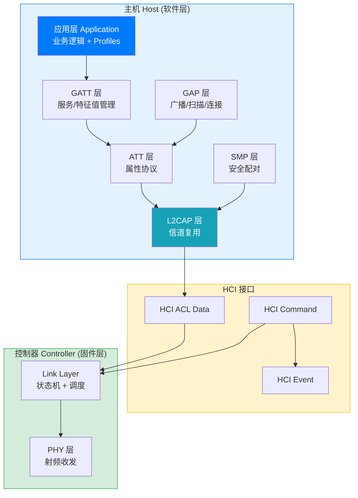

### 2.2 开发者关注点

| 层 | 职责 | 开发者接口 | 典型 API | 关注程度 |
|------|------|------------|----------|----------|
| **Application** | 业务逻辑实现 | Profile SDK | readCharacteristic(), write() | ⭐⭐⭐⭐⭐ |
| **GATT** | 服务/特征值管理 | GATT Profile | addService(), addCharacteristic() | ⭐⭐⭐⭐⭐ |
| **GAP** | 设备发现与连接 | Advertising/Scan API | startAdvertising(), connect() | ⭐⭐⭐⭐⭐ |
| **ATT** | 属性访问协议 | 内部使用 | Read/Write/Notify Request | ⭐⭐⭐ |
| **L2CAP** | 信道复用与分段 | LE Credit Based | connectChannel(), send() | ⭐⭐ |
| **HCI** | 主机控制器通信 | HCI Command/Event | hci_send_cmd(), hci_read_evt() | ⭐⭐⭐ |
| **Link Layer** | 连接调度与状态机 | 固件实现 | 自动处理 | ⭐ |
| **PHY** | 射频收发 | 固件实现 | 自动处理 | ⭐ |

### 2.3 数据包结构详解

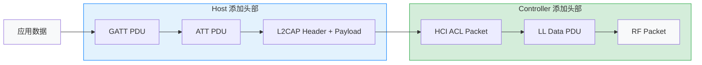

### 2.4 各层 MTU 对比

| 层 | PDU 名称 | 最大负载 | 头部开销 |
|------|----------|----------|----------|
| **PHY** | Physical Channel PDU | 37 bytes | 10 bytes |
| **LL** | LL Data PDU (BLE 4.x) | 27 bytes | 2 bytes |
| **LL** | LL Data PDU (BLE 5.0+) | 251 bytes | 2 bytes |
| **L2CAP** | L2CAP PDU | 65535 bytes | 4 bytes |
| **ATT** | ATT PDU | MTU - 3 bytes | 1 byte (Opcode) |
| **GATT** | Attribute Value | MTU - 4 bytes | 2 bytes (Handle) + 1 byte |

---

## 三、连接管理与参数优化

### 3.1 BLE 连接流程


### 3.2 连接序列图

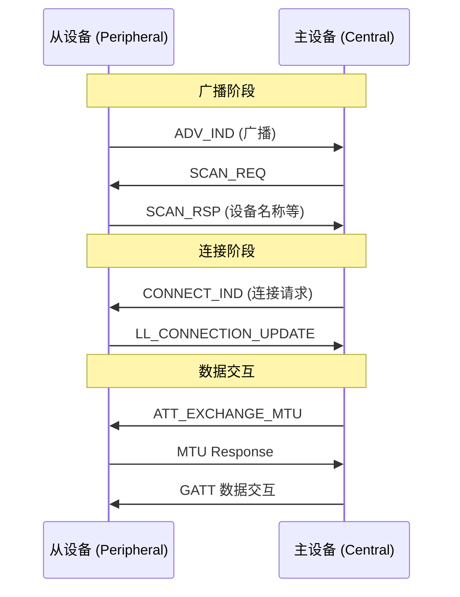

### 3.3 连接参数详解

| 参数 | 范围 | 典型场景 |
|------|------|----------|
| **interval** | 7.5ms - 4s | 实时：7.5ms, 传感器：1s |
| **slave_latency** | 0 - 499 | 省电：99, 低延迟：0 |
| **supervision_timeout** | 100ms - 32s | 100ms - 32s |

### 3.4 连接优化场景

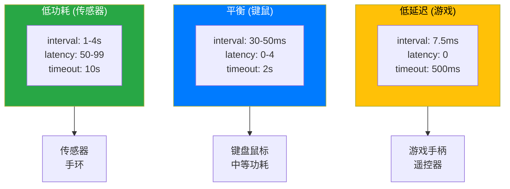

| 场景 | interval | latency | timeout |
|------|----------|---------|---------|
| 低延迟 (游戏) | 7.5ms | 0 | 500ms |
| 平衡 (键鼠) | 30-50ms | 0-4 | 2s |
| 低功耗 (传感器) | 1-4s | 50-99 | 10s |

---

## 四、GATT 数据传输

### 4.1 数据传输模式

| 模式 | ATT Opcode | 确认 | 适用场景 |
|------|------------|------|----------|
| **Read** | 0x0A/0x0B | 需要 | 配置读取、状态查询 |
| **Write** | 0x12/0x13 | 需要 | 控制指令、写入确认 |
| **Write Without Response** | 0x52 | 不需要 | 大数据流、按键事件 |
| **Notify** | 0x1B | 不需要 | 传感器数据、心率 |
| **Indicate** | 0x1D | 需要 | 重要告警、OTA 升级 |

### 4.2 常用 UUID

| 服务/特征 | UUID |
|-----------|------|
| 电池服务 | 180f |
| 电池电量 | 2a19 |
| 心率服务 | 180d |
| 心率测量 | 2a37 |
| 设备信息 | 180a |

### 4.3 MTU 协商

```
// MTU: 默认 23 bytes, BLE 5.0 最大 512 bytes
// 性能对比:
// MTU=23: 每次传输 20 字节
// MTU=512: 每次传输 509 字节 (提升 25 倍)
```

---

## 五、BLE 开发核心

### 5.1 GAP 角色与模式

| 角色 | 说明 | 典型设备 |
|------|------|----------|
| **Peripheral (周边)** | 广播设备，被中心扫描连接 | 传感器、手环 |
| **Central (中心)** | 扫描并连接周边设备 | 手机、PC |
| **Observer (观察者)** | 仅扫描，不连接 | 蓝牙定位器 |
| **Broadcaster (广播者)** | 仅广播，不连接 | Beacon |

### 5.2 广播类型

| 类型 | PDU | 用途 | 响应 |
|------|-----|------|------|
| **ADV_IND** | 可连接非定向 | 一般广播 | SCAN_REQ / CONNECT_IND |
| **ADV_DIRECT_IND** | 可连接定向 | 快速重连 | CONNECT_IND |
| **ADV_SCAN_IND** | 可扫描非定向 | 获取设备名称 | SCAN_RSP |
| **ADV_NONCONN_IND** | 不可连接非定向 | Beacon | 无 |

---

## 六、安全机制与配对

### 6.1 经典蓝牙 vs BLE 安全对比

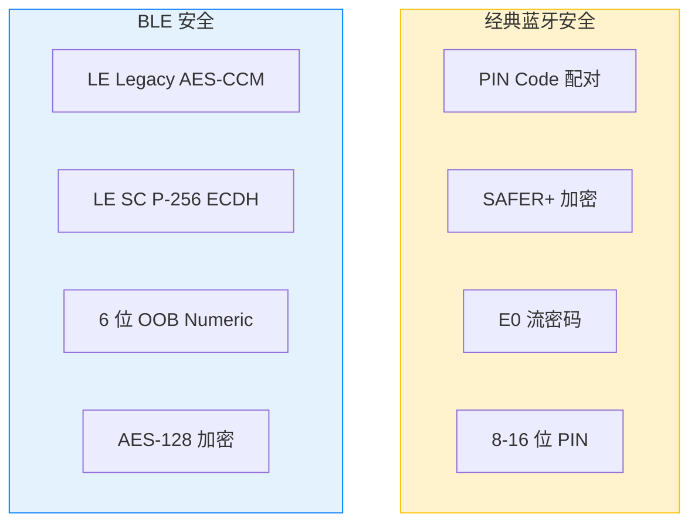

| 特性 | 经典蓝牙 (BR/EDR) | BLE (低功耗) |
|------|-------------------|--------------|
| **配对方式** | PIN Code (8-16 位) | Passkey (6 位)/OOB/Numeric |
| **加密算法** | E0 流密码 / SAFER+ | AES-128 CCM |
| **密钥长度** | 8-16 bytes | 7-16 bytes |
| **密钥生成** | 基于 PIN + BD_ADDR | ECDH 密钥交换 |
| **MITM 保护** | 可选 | LE SC 强制 |

### 6.2 BLE 配对方式对比

| 配对方式 | IO 能力要求 | MITM 保护 | 安全性 | 典型场景 |
|----------|-------------|-----------|--------|----------|
| **Just Works** | 无显示/无输入 | ❌ 无 | 低 | 手环、传感器 |
| **Passkey Entry** | 键盘或显示 | ✅ 有 | 中 | 键盘、电视 |
| **Numeric Comparison** | 双方都有显示 | ✅ 有 | 高 | 手机对手机 |
| **OOB (Out of Band)** | NFC/其他通道 | ✅ 有 | 最高 | NFC 配对 |

### 6.3 设备无显示屏的配对方案

| 方案 | 硬件要求 | 安全性 | 用户体验 | 典型设备 |
|------|----------|--------|----------|----------|
| **Just Works** | 无 | ⚠️ 低 (无 MITM) | ✅ 最简单 | 手环、传感器 |
| **固定 PIN** | 无 | ⚠️ 中 (PIN 可能泄露) | ✅ 简单 | 耳机、车载 |
| **包装印刷 PIN** | 无 | ✅ 高 (唯一 PIN) | ✅ 简单 | 智能锁、医疗设备 |
| **二维码/NFC** | NFC 或二维码标签 | ✅ 高 (OOB 认证) | ✅ 扫码即可 | 智能家居 |
| **物理按钮确认** | 一个按钮 | ✅ 高 (用户确认) | ⚠️ 需按按钮 | 智能锁、开关 |

---

## 七、实践案例解析

### 7.1 案例技术对比

| 设备类型 | 蓝牙类型 | Profile | 连接间隔 | 功耗 |
|----------|----------|---------|----------|------|
| **心率传感器** | BLE | HRM (0x180D) | 100-500ms | 极低 |
| **GPS 追踪器** | BLE | 自定义 GATT | 1-10s | 低 |
| **蓝牙鼠标** | BLE | HID over GATT | 7.5-20ms | 低 |
| **蓝牙键盘** | BLE | HID over GATT | 20-50ms | 低 |
| **蓝牙耳机** | 经典蓝牙 | A2DP + HFP | 连续 | 高 |

### 7.2 心率传感器 (HRM)

#### 系统架构

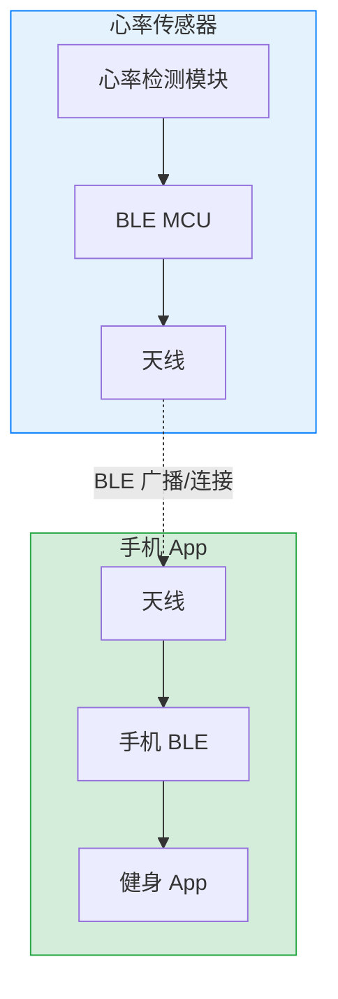

#### HRM Profile 结构

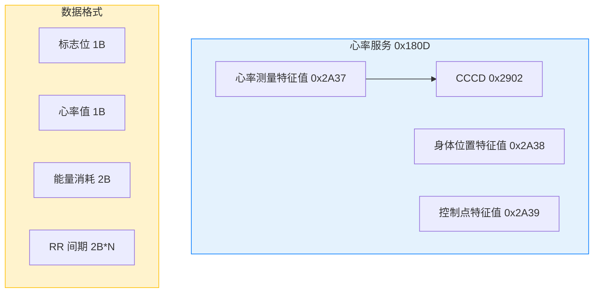

#### 特征值说明

| 特征值 | UUID | 权限 | 用途 | 是否必需 |
|--------|------|------|------|----------|
| **心率测量** | 0x2A37 | Notify | 实时推送心率和 RR 间期 | ✅ 必需 |
| **身体位置** | 0x2A38 | Read | 设备佩戴位置 (手腕/胸部等) | ⭕ 可选 |
| **控制点** | 0x2A39 | Write | 重置能量消耗累计值 | ⭕ 可选 |
| **CCCD** | 0x2902 | Read/Write | 启用/禁用通知 | ✅ 必需 |

#### 完整工作流程

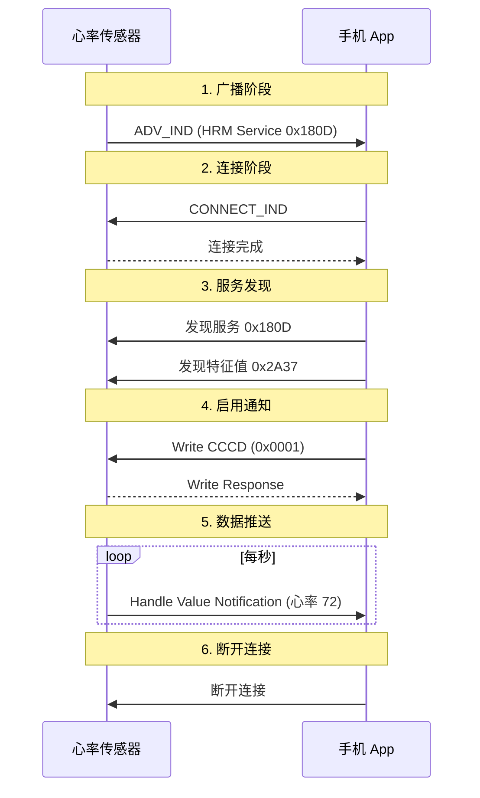

### 7.3 蓝牙键盘

#### 系统架构

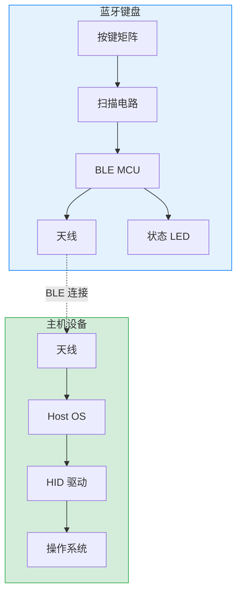

#### HID 键盘报告格式

```c
// HID 键盘输入报告 (标准 8 键无冲)
// Report ID: 0x01
// 总长度：8 bytes

typedef struct {
    uint8_t  report_id;      // Report ID (0x01)
    uint8_t  modifier;       // 修饰键 (Ctrl/Shift/Alt 等)
    uint8_t  reserved;       // 保留
    uint8_t  keycode[6];     // 按键码 (最多 6 键同时按下)
} keyboard_input_report_t;

// 修饰键位定义
#define KB_MOD_LCTRL    0x01
#define KB_MOD_LSHIFT   0x02
#define KB_MOD_LALT     0x04
#define KB_MOD_LGUI     0x08  // Windows/Command

// 常用按键码
#define KB_KEY_A        0x04
#define KB_KEY_ENTER    0x28
#define KB_KEY_ESCAPE   0x29
#define KB_KEY_SPACE    0x2C
```

#### 多设备切换

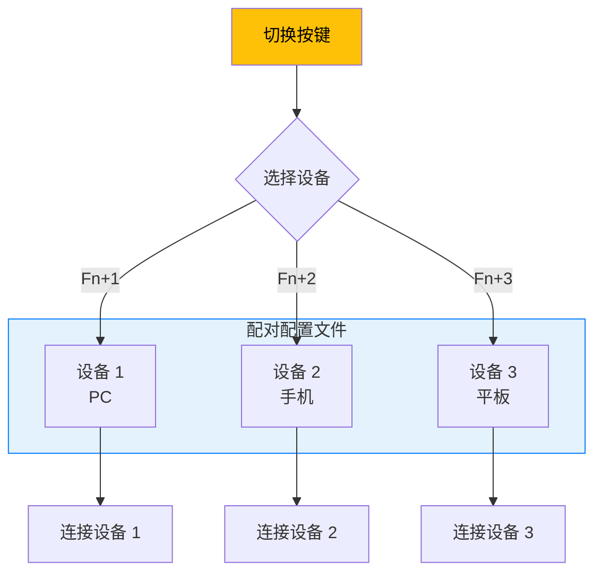

#### 功耗优化

| 参数 | 配置值 | 说明 |
|------|--------|------|
| **连接间隔** | 20ms - 50ms | 键盘不需要超低延迟 |
| **从机延迟** | 4-9 | 允许跳过事件 |
| **监督超时** | 2s | 平衡功耗与响应 |
| **广播间隔** | 30-60ms | 快速重连 |
| **休眠电流** | <5μA | 深度睡眠 |

---

## 八、技术选型指南

### 8.1 蓝牙 vs 其他协议

| 协议 | 频段 | 速率 | 功耗 | 范围 | 典型应用 |
|------|------|------|------|------|----------|
| **BLE** | 2.4GHz | 1-2Mbps | 极低 | 10-100m | IoT、可穿戴 |
| **经典蓝牙** | 2.4GHz | 1-3Mbps | 中 | 10-100m | 音频、文件 |
| **WiFi** | 2.4/5GHz | 100+Mbps | 高 | 10-50m | 上网、视频 |
| **Zigbee** | 2.4GHz | 250kbps | 低 | 10-100m | 智能家居 |
| **LoRa** | 433MHz-868MHz | 0.3-50kbps | 极低 | 2-15km | 远距传感 |

### 8.2 协议选型决策树

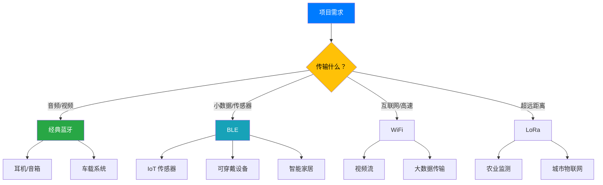

### 8.3 开发调试工具推荐

#### 手机 App
- **nRF Connect** - Nordic 官方，功能最全
- **LightBlue** - iOS 首选，界面友好
- **BLE Scanner** - 跨平台，开源

#### PC 工具
- **nRF Connect Desktop** - 桌面版调试工具
- **Wireshark + Ubertooth** - 空口抓包
- **Ellisys** - 专业协议分析

#### 开发板
- **nRF52840 DK** - Nordic 官方开发板
- **ESP32 DevKit** - 便宜，WiFi+BLE
- **CC2650 LaunchPad** - TI 开发板

---

## 常见问题与排错

| 问题 | 可能原因 | 解决方案 |
|------|----------|----------|
| 设备无法被发现 | 未开启广播/距离过远 | 检查广播参数/缩短距离 |
| 连接经常断开 | 参数不当/信号弱 | 调整 interval/latency |
| 数据发送失败 | MTU 不匹配/特征值属性 | 协商 MTU/检查属性 |
| 配对失败 | IO 能力不匹配 | 检查配对参数 |

---

## 总结

蓝牙技术经过 20 多年的发展，已经从最初的音频传输协议演变为支持 IoT、定位、音频、Mesh 组网等多场景的综合性无线通信标准。

**对于开发者而言：**
- **BLE 4.0+** 是 IoT 设备的起点
- **GATT Profile** 是应用开发的核心
- **连接参数优化** 决定功耗与性能平衡
- **安全配对** 保护用户数据隐私

**选型建议：**
- 音频设备 → 经典蓝牙 (A2DP/HFP)
- 传感器/可穿戴 → BLE
- 需要联网 → WiFi+BLE 双模 (ESP32)
- 超远距离 → LoRa

掌握蓝牙协议栈各层职责、数据包结构和调试方法，将帮助开发者高效构建稳定可靠的蓝牙产品。

---

*本文基于蓝牙技术官方文档和开源教程整理，适用于软件开发人员快速入门蓝牙开发。*
